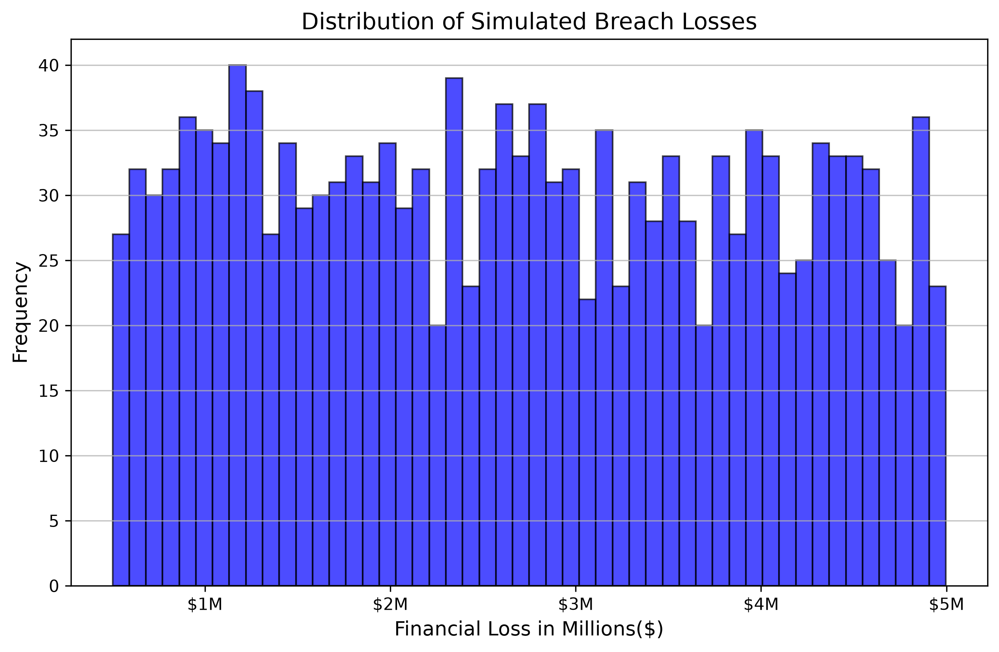

# FAIR-Cybersecurity-Risk-Simulation

## Objective
A Python-based Monte Carlo simulation engine that translates qualitative cybersecurity threats into quantitative financial risk models based on the Factor Analysis of Information Risk (FAIR) methodology. 

## Purpose
Provides quantitative predictions of cybsersecurity incidents of various severities.
* Directly aligns with the SEC mandate for assessing the "material financial impact" of cyber incidents.
* Calculates Annualized Expected Loss and Maximum Worst-Case Incident.
* Dynamically adjusts to model various threat profiles (e.g., Ransomware vs. Wire Fraud).

## Technical Stack
* **Language:** Python
* **Data Modeling:** `numpy` (Probability distribution and statistical sampling)
* **Data Visualization:** `matplotlib` (Financial histogram generation)

## Output Example
*(Simulating 10,000 iterations of a high-impact enterprise data breach e.g. Ransomware)*
* **Annualized Probability of Occurrence:** 15.0%
* **Minimum Estimated Impact:** $500,000
* **Maximum Estimated Impact:** $50,000,000

**Calculated Annualized Expected Loss:** $3,931,903.24

**Maximum Worst-Case Exposure:** $49,973,303.71

